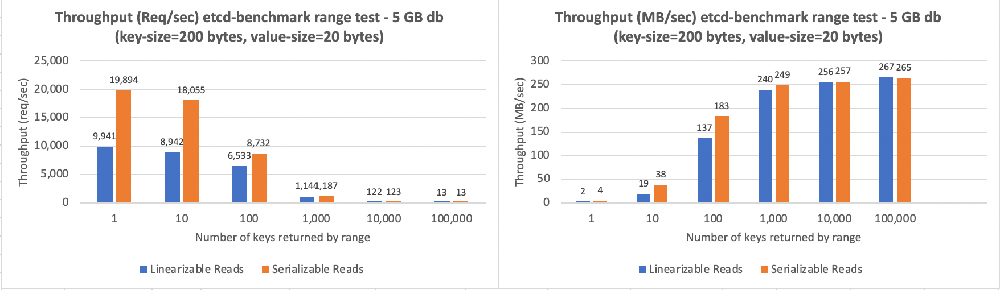

# test-harness

This test harness, constructed in the fall of 2020, relies on a previously configured etcd-operator for constructing the etcd cluster. Specifically the scripts were developed to deploy a cluster within the carrier501 tugboat where the armada microservice etcd is deployed (see [Approach to testing etcd](../README.md#approach-to-testing-etcd)). The script are general enough that they should work in another environment, though the ETCD_VIP_ENDPOINTS, defined in etcd-perftest-config, access point won't work. If a different tugboat is used then it is likely that the DNS name on the following line of etcd-perftest-config will have to be changed:

```
ETCD_VIP_ENDPOINTS=etcd-5-1.us-south.containers.test.cloud.ibm.com:30071,etcd-5-2.us-south.containers.test.cloud.ibm.com:30071,etcd-5-3.us-south.containers.test.cloud.ibm.com:30071
```

## Cluster management

* `etcd-perftest-config` - Defines the config of cluster, its access points, and additional variables that control the scripts. Used by all scripts. Visit this first before using any script.
* `deploy-etcd.sh [delete]` - Creates or deletes the cluster defined by etcd-perftest-config
* `defrag-etcd.sh [compact]` - Defrags, and optionally compacts, the etcd cluster
* `get-etcd-endpoint-status.sh` - Most useful to see the size of the database and if each server is viable. Called from several scripts.
* `get-etcd-logs.sh` - Get the logs from each etcd servers and puts them in `logs/$(date +"%Y-%m-%d-%H-%M")/<pod>.log. Also puts output of `get pods` in `pods.log`.
* `updateTestConfigFile.sh` - Extracts the sevice endpoints of the cluster and updates etcd-perftest-config. Called by `deploy-etcd.sh`.
* `generate-etcd-certs.sh` - Creates the certificates. Called by `deploy-etcd.sh`.

### Cluster configuration files

The deploy-etcd.sh script reliese on the following files. The default name for the cluster is `etcd-perftest`. If a different name is specified in `etcd-perftest-config`, via ETCDCLUSTER_NAME, then the first time `deploy-etcd.sh` is run it will duplicate this set of files with a set with a prefix defined by `${ETCDCLUSTER_NAME}`. 

* `etcd-perftest.yml` - Etcd cluster definition that supports encrypted communication.
* `etcd-perftest.notls.yml` - Etcd cluster definition without encryption.
* `etcd-perftest-client-service-lb.yml` - Load balancer service endpoint for the cluster.
* `etcd-perftest-client-service-np.yml` - Node port service endpoint for the cluster.
* `etcd-perftest-server-tls.yml` - Server TLS definitions. This file isn't checked in do to security constraints.
* `etcd-[peer|server]-csr.json.template` - Templates for certificate generation.
* `\*.json` - Certificate configuration for cfssl

## Tests

Tests are either run from a performance client (i.e. the scripts listed below) or run via the helm charts in [../etcd-driver/imageDeploy](../etcd-driver/imageDeploy). The helm charts are the mechanism for scaling the load.  The scripts below assume that etcdctl, etcd-driver, and etcd-benchmark are available via PATH.

* `etcdRangeTest.sh [setup]` - Runs a series of range tests, using either serializable or linearizable consistency. The goal is to test how range requests perform with requests of different sizes (i.e. from 1 to 100000 keys, incremented by a factor of 10). `etcdRangeTest.sh setup` must be run first to load the keys in the database. 

* `put-test-etcd.sh` - Runs a simple `etcd-benchmark put` test.
* `run-etcd-driver.sh` - Runs a single `etcd-driver pattern` test.
* `stop-etcd-driver.sh` - Stops etcd-driver test by writing `true` to the `/test1/end` key.

## Utilities

* `fill-etcd.sh` - Used to add FILL_GB GB of data to the database. Currently FILL_GB=5
* `fill-etcd-pattern.sh` - Puts 1 million keys (TOTAL_PUTS) using the pattern defined by etcd.onemillionkeys.fast.pattern.txt
* `fill-etcd-pattern-one.sh` - Used to add FILL_GB GB of data to the database using the etcd.77-8000.fast.pattern.txt pattern. Currently FILL_GB=5
e `fill-etcd-pattern-1millionkeys.sh` - Puts 1 million keys using the pattern defined by etcd.onemillionkeys.fast.pattern.txt
* `get-armada-etcd-logs.sh` - Extracts the armada etcd logs and puts them in `./<pod name>.$(date +"%Y-%m-%d-%H-%M").log`. Currently hardcoded to pull logs in pods with `-l etcd_cluster=etcd-501-armada-stage5-south`.
* `etcd.77-8000.pattern.txt` - The original pattern for filling the database. Outdated by the faster etcd.77-8000.fast.pattern.txt.
* `etcd-perftest-peer-tls.yml` - Client TLS definitions. This file isn't checked in do to security constraints.
